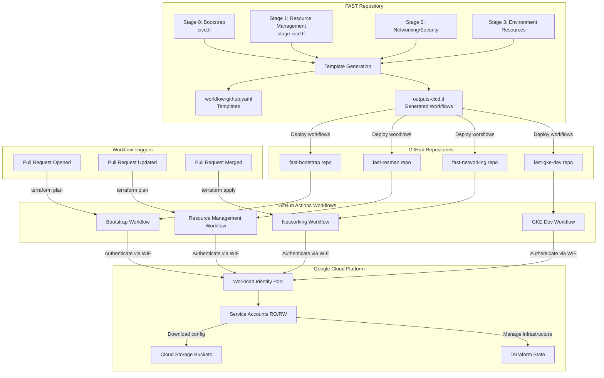
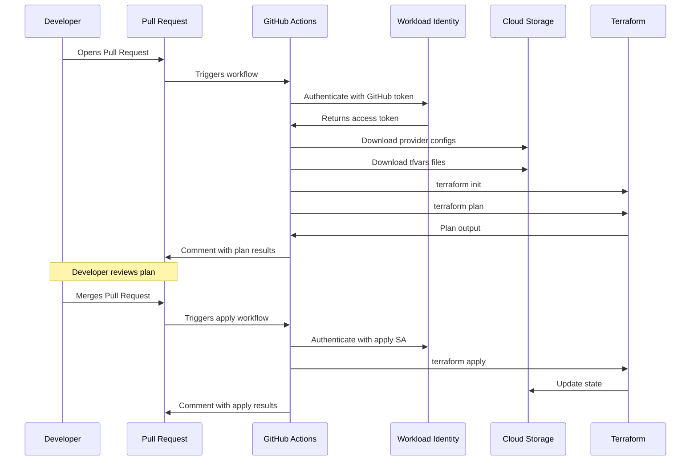
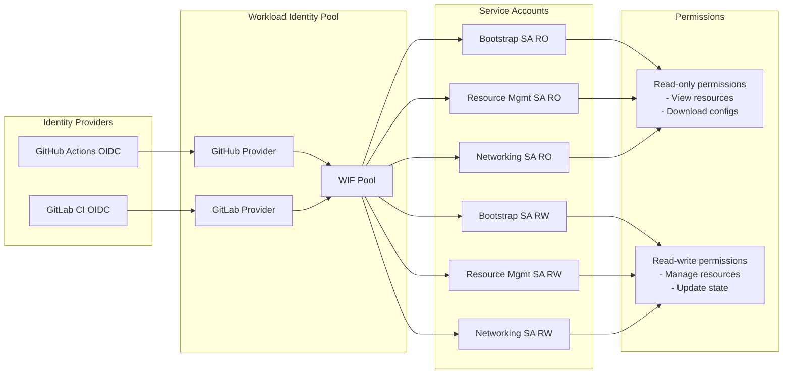

# Architektura workflow CI/CD w FAST

```mermaid
graph TB
    subgraph "FAST Repository"
        A[Stage 0: Bootstrap<br/>cicd.tf] --> B[Template Generation]
        C[Stage 1: Resource Management<br/>stage-cicd.tf] --> B
        D[Stage 2: Networking/Security] --> B
        E[Stage 3: Environment Resources] --> B
        
        B --> F[workflow-github.yaml<br/>Templates]
        B --> G[outputs-cicd.tf<br/>Generated Workflows]
    end
    
    subgraph "GitHub Repositories"
        H[fast-bootstrap repo]
        I[fast-resman repo]
        J[fast-networking repo]
        K[fast-gke-dev repo]
    end
    
    subgraph "GitHub Actions Workflows"
        L[Bootstrap Workflow]
        M[Resource Management Workflow]
        N[Networking Workflow]
        O[GKE Dev Workflow]
    end
    
    subgraph "Google Cloud Platform"
        P[Workload Identity Pool]
        Q[Service Accounts RO/RW]
        R[Cloud Storage Buckets]
        S[Terraform State]
    end
    
    G -->|Deploy workflows| H
    G -->|Deploy workflows| I
    G -->|Deploy workflows| J
    G -->|Deploy workflows| K
    
    H --> L
    I --> M
    J --> N
    K --> O
    
    L -->|Authenticate via WIF| P
    M -->|Authenticate via WIF| P
    N -->|Authenticate via WIF| P
    O -->|Authenticate via WIF| P
    
    P --> Q
    Q -->|Download config| R
    Q -->|Manage infrastructure| S
    
    subgraph "Workflow Triggers"
        T[Pull Request Opened] -->|terraform plan| L
        U[Pull Request Updated] -->|terraform plan| M
        V[Pull Request Merged] -->|terraform apply| N
    end
```

## Przepływ danych między stage'ami

```mermaid
sequenceDiagram
    participant Dev as Developer
    participant PR as Pull Request
    participant GHA as GitHub Actions
    participant WIF as Workload Identity
    participant GCS as Cloud Storage
    participant TF as Terraform
    
    Dev->>PR: Opens Pull Request
    PR->>GHA: Triggers workflow
    GHA->>WIF: Authenticate with GitHub token
    WIF->>GHA: Returns access token
    GHA->>GCS: Download provider configs
    GHA->>GCS: Download tfvars files
    GHA->>TF: terraform init
    GHA->>TF: terraform plan
    TF->>GHA: Plan output
    GHA->>PR: Comment with plan results
    
    Note over Dev,PR: Developer reviews plan
    
    Dev->>PR: Merges Pull Request
    PR->>GHA: Triggers apply workflow
    GHA->>WIF: Authenticate with apply SA
    GHA->>TF: terraform apply
    TF->>GCS: Update state
    GHA->>PR: Comment with apply results
```

## Struktura uprawnień

```mermaid
graph LR
    subgraph "Identity Providers"
        A[GitHub Actions OIDC]
        B[GitLab CI OIDC]
    end
    
    subgraph "Workload Identity Pool"
        C[WIF Pool]
        D[GitHub Provider]
        E[GitLab Provider]
    end
    
    subgraph "Service Accounts"
        F[Bootstrap SA RO]
        G[Bootstrap SA RW]
        H[Resource Mgmt SA RO]
        I[Resource Mgmt SA RW]
        J[Networking SA RO]
        K[Networking SA RW]
    end
    
    subgraph "Permissions"
        L[Read-only permissions<br/>- View resources<br/>- Download configs]
        M[Read-write permissions<br/>- Manage resources<br/>- Update state]
    end
    
    A --> D
    B --> E
    D --> C
    E --> C
    
    C --> F
    C --> G
    C --> H
    C --> I
    C --> J
    C --> K
    
    F --> L
    H --> L
    J --> L
    
    G --> M
    I --> M
    K --> M
```